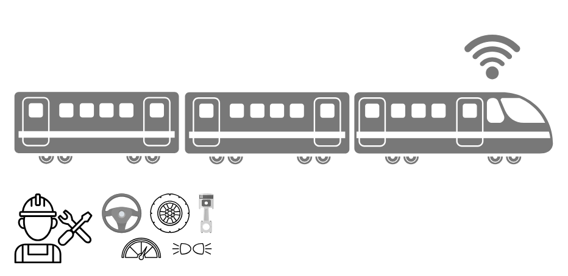

# 내가 하는 TDD는 왜 실패하는가?

## 상황
 - 레거시 코드가 많음. 서비스는 운 좋게도 매년 성장했음.
 - 개발자가 2배 늘었지만, 개발 속도는 1.2배 정도에 그쳤음.
   - (커뮤니케이션 비용 등) 서비스 장애를 우려해서 배포를 신중하게 했음.
   - 회귀 버그 -> 잘 동작하는 기능이 다시 버그가 발생하는 상황
   - 테스트 자동화 도입으로 회귀 버그를 줄이고자 했음.
 - 테스트 자동화로 인해 커버리지를 높일 수 있음.
 - 외부 API 연동, DB 연동 등 쉽지 않은 테스트 케이스를 마주하게 됨.
   - mockito나 H2를 활용해서 처리함.
   - 다만, 서비스는 단순한데, 이 단순한 서비스 로직 확인을 위해 테스트를 작성하는 일로 인해 더욱 복잡하게 되어 버림.
 - 스프링 부트와 H2를 사용하니 100개가 넘는 테스트를 하는 데 2분이 넘게 걸리게 됨.
 - 테스트 결과가 일관적이지 않은 경우도 발생함. -> 비결정적인 테스트
   - 너무 느리고, 비결정적이고, 뭘 하는 테스트인지 눈에 들어오지 않음. -> ‘이럴거면 테스트를 왜 하지?’가 되어 버림.

## 문제 정의
1. 레거시 코드에 테스트를 넣는 게 TDD가 아님.
   - 테스트를 넣을 때 자연스럽게 넣는 법을 알아야 함.
2. 레거시에 테스트를 넣으려면 코드 개선이 필요함.
 - 테스트의 목적
   - 회귀 버그 방지
   - 유연한 설계로의 개선 -> 앞선 문제점들이 프로젝트가 뻣뻣한 설계를 갖고 있어서라고 생각함.
       - 테스트를 쉽게 만들어줌.
       - 테스트를 결정적이게 만들어줌
       - 테스트는 외부 시스템에 의존되는 상황을 없애고자 노력해야 함.
         -> 매우 도전적이기도 함. 우리 시스템에는 회귀 테스트가 없기 때문임.(구글도 2005년에 도입했다고 함.)
3. 커버리지에 집착하면 안됨.
   - 커버리지에 집착하면 원래 테스트의 목적성을 잃어버리게 됨.
   - 테스트 추가로 얻을 수 있는 효용성에 집중해야 함.

우리는 문제는 그동안 커버리지를 올리기 위한 mock 프레임워크 사용법만 고민하고, 왜 테스트를 사용해야하고 어떻게 테스트 해야하는지 고민하지 않았던 것이었다.

 - 전통적인 서비스의 성장 방식은
소형차 -> 중형차 -> 대형차 순차적으로 성장함.
 - 사실 성장보단 매번 새로운 것을 만들어내는 행위에 가까움.
   - 그 말은 다음 개발을 하는 데 오래 걸린다는 것임.
   - 중형차 단계에서 많은 사용자가 몰렸을 때 대형차 개발까지 1년이 걸린다면, 소비자는 기다리지 않음.

테스트와 확장성을 동시에 지닌 서비스의 성장 방식
-> 기차와 같은 형식
- 객실을 추가하면 됨.(객실은 안정성이 보장된 상태)

방향성 -> TDD를 논하기 전 프로젝트는 테스트가 가능한 구조로 변경되어야 함.

# 강의 순서
1. 테스트 이론
 - 테스트에 필요한 이론 학습
2. 실기 1부
 - 미리 준비된 토이 프로젝트를 이용해서 테스트를 넣어볼 건데, 설계를 개선하지 않고 mockito 같은 프레임 워크를 이용해서, 어거지로 커버리지 100에 근사하도록 함.
3. 방향성 탐색
 - 테스트를 설계 가능한 구조로 변경하면서 진행
4. 실기 2부
 - 설계 개선하며 테스트를 넣어볼 것임. mockito나 h2 없이 테스트하는 법에 대해 다룸.
5. 아키텍처 & 부록
 - 좋은 설계를 하기 위해 아키텍처는 필수라고 생각되어 넣었음.